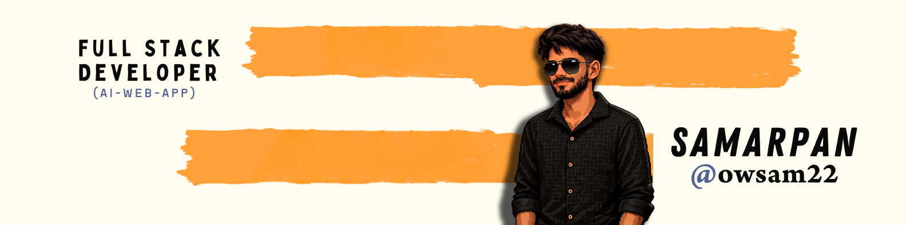

<!-- Header Section -->

  

  

  

<!-- BOX GRID STARTS HERE -->
<table width="100%">
<tr>
<td width="50%" valign="top">

### 🚀 About Me
**Full-Stack Developer** & **AI/ML Enthusiast** — B.Tech CSE (Data Science) student building intelligent, scalable apps where design meets development.

- 🌱 Learning: Deep Learning & Cloud Architecture

</td>
<td width="50%" valign="top">

### 🚧 Currently Building
- 🔗 [Telegram bot for google form](https://github.com/owsam22/google-sheet-notification-bot)
- 🔗 [GitGalaxy](https://github.com/owsam22/git-galaxy)
- 🔗 [And Many More ](https://github.com/owsam22?tab=repositories)
  

</td>
</tr>

<tr>
<td width="50%" valign="top">

### 💻 Tech Stack

</td>
<td width="50%" valign="top">

### 📊 GitHub Streak

</td>
</tr>
</table>

<h2 align="center">🌍 Find Me Around the Web</h2>

<!--contact section--->

  

  <b>"Automating the present, building the future."</b> 
  

